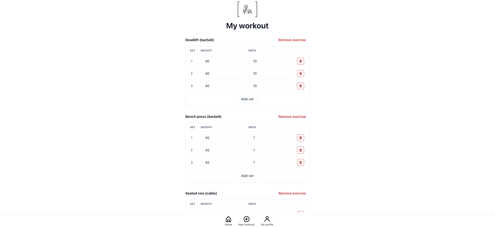

# More Reps

More Reps is an open-source fitness tracker, currently running at [morereps.app](https://morereps.app).

It was created for two reasons:
1. To provide a really simple, free, fitness tracker for anyone looking for one.
2. To show what can be done with frameworks such as [Next.js](https://nextjs.org/), [Next Auth](https://next-auth.js.org/), [Chakra UI](https://chakra-ui.com/), and [Prisma](https://www.prisma.io).

You are welcome to use the app, inspect its source code, or even contribute to it.



## Running locally

First, run the development server:

```bash  
npm run dev
```

Open [http://localhost:3000](http://localhost:3000) with your browser to see the result.

## Deployment

The production version is deployed off the main branch to [morereps.app](https://morereps.app). The application server and the database is hosted by [Fly.io](https://fly.io/).

## Contributing

PRs with content contributions and bug fixes are always welcome, see the [contributing guidelines](CONTRIBUTING.MD).

If you have an idea for a new feature, please open an issue first so it can be discussed and vetted before contributing.